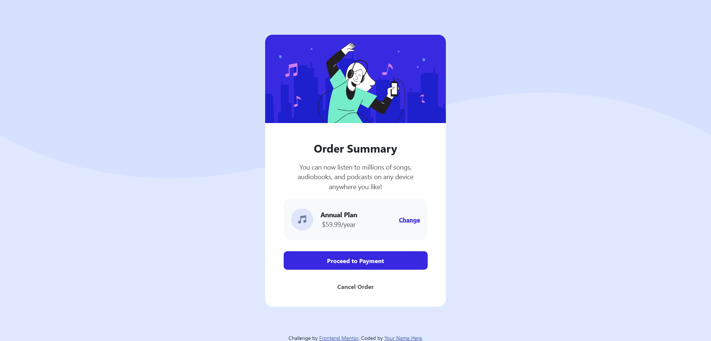

# Frontend Mentor - Order summary card solution

This is a solution to the [Order summary card challenge on Frontend Mentor](https://www.frontendmentor.io/challenges/order-summary-component-QlPmajDUj). Frontend Mentor challenges help you improve your coding skills by building realistic projects. 

## Table of contents

- [Overview](#overview)
  - [The challenge](#the-challenge)
  - [Screenshot](#screenshot)
  - [Links](#links)
- [My process](#my-process)
  - [Built with](#built-with)
  - [What I learned](#what-i-learned)
  - [Continued development](#continued-development)
  - [Useful resources](#useful-resources)
- [Author](#author)
- [Acknowledgments](#acknowledgments)

## Overview

### The challenge

Users should be able to:

- See hover states for interactive elements

### Screenshot




### Links

- Link: [ordersummarycard](https://github.com/denialgrey/ordersummarycard)

## My process

### Built with

- Semantic HTML5 markup
- CSS custom properties
- [Bootstrap](https://getbootstrap.com/) - CSS framework


### What I learned

```html
<h1>Some HTML code I'm proud of</h1>
```
```css
.body {
  background-image: url("images/pattern-background-desktop.svg");
  background-repeat: no-repeat;
  background-size: contain;
  background-position-y: -80px;
}

@media screen and (max-width: 412px){
  code
}
```
```html bootstrap
<div class="d-flex align-items-center">
  
  <p class="my-1">
    <b>Annual Plan</b>
    <br> 
    <span class="text-body-secondary">$59.99/year</span>
  </p>
            
          
  <a href="#" class="p-3 ms-auto">
    <b>Change</b> 
  </a> </div>
<div class="d-flex flex-column">Some HTML code I'm proud of </div>
```

### Useful resources

- [Bootstrap](https://getbootstrap.com/) - I used this framework for create websites more effciently.
- [frontendmentor](https://www.example.com) - This website actually give me for hopes for becoming a front-end web developer.
- [MDN Web Docs](https://developer.mozilla.org/en-US/docs/Web/CSS/background-blend-mode) - I used this to revise html and css codes.

## Author
- Frontend Mentor - [@denialgrey](https://www.frontendmentor.io/profile/denialgrey

